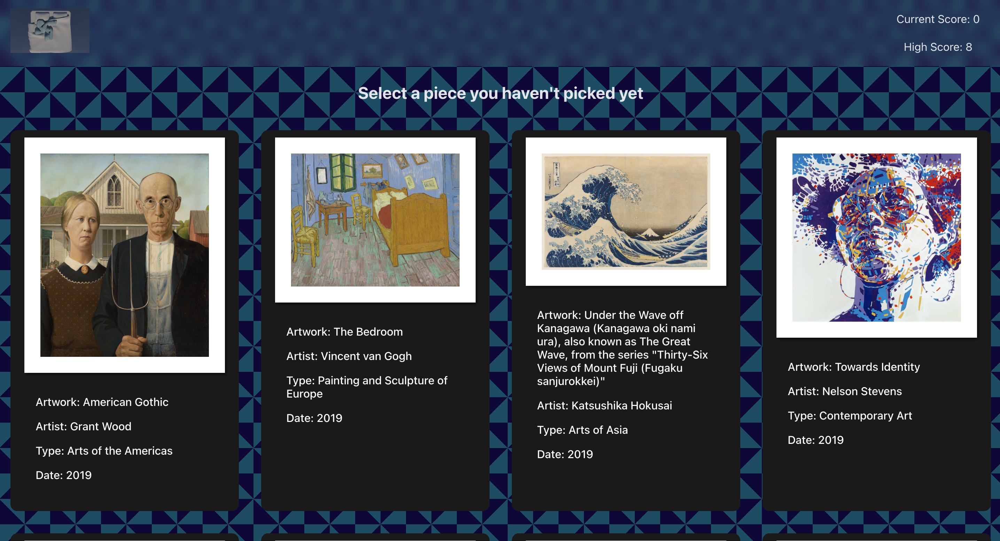

# Arty Farty Memory Game
Simple memory game intended to practice fundamental react concepts learnt as part of The Odin Project. Including state, props, data fetching with useEffect and many more!

Data fetched from the [Art Institute of Chicago's API](https://api.artic.edu/docs/#introduction)

Final outcome: 

Using the stack below...

# React + Vite

This template provides a minimal setup to get React working in Vite with HMR and some ESLint rules.

Currently, two official plugins are available:

- [@vitejs/plugin-react](https://github.com/vitejs/vite-plugin-react/blob/main/packages/plugin-react/README.md) uses [Babel](https://babeljs.io/) for Fast Refresh
- [@vitejs/plugin-react-swc](https://github.com/vitejs/vite-plugin-react-swc) uses [SWC](https://swc.rs/) for Fast Refresh
